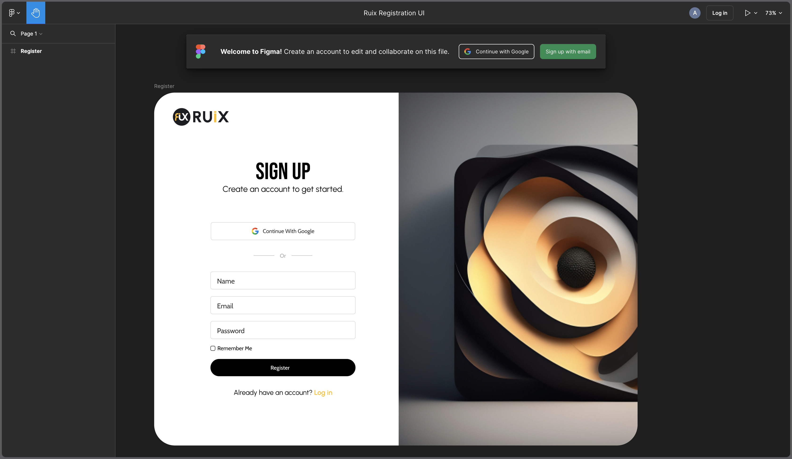
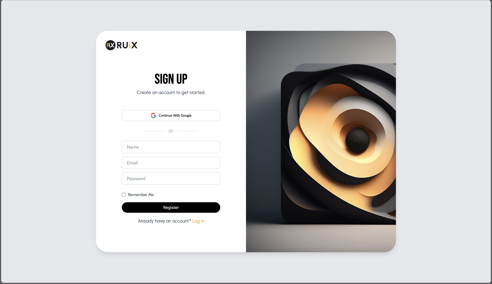

#### Ruix Signup

###### Date Started: 06/15/2024

###### Last Updated: 06/20/2024

###### Deployment: Netlify

###### Get Started with React: [what to do ?](https://github.com/fullstacktutorials/install-reactjs)

---

###### Tech Stack: ReactJS Tailwind Figma

---

##### Welcome to Ruix Signup! If you're here, you're checking out how to make your own Signup Page and you can rest assured that you come to the right place. Feel free to explore around, check my partner's github as well and remember, the code is yours to adapt and use however you like.Enjoy!

---

##### Note: The first image is the one of the figma file and the second image is the project done

---

---

---

###### Features:

##### Signup Page that allows you to signup using google sign in or filling in the signup details

###### Process:

##### - Started with a React template
##### - Worked on the structure of the signup
##### - Used Tailwind to play around with the look and feel until it closely related the figma file
##### - Worked on the functionality there-after

###### Learnings:

##### - Gained a deeper understanding on the use of Figma
##### - Built on my skills of React and tailwind 
